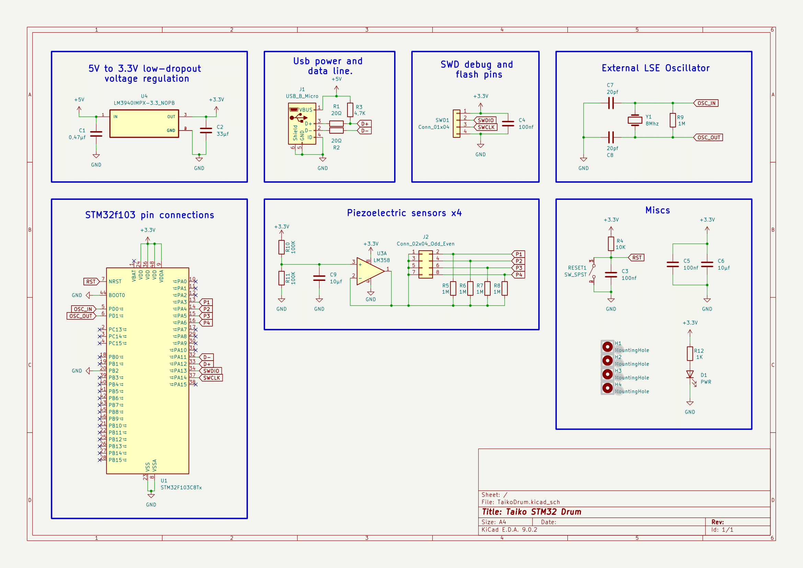

# 🥁 Osu! Taiko Drum Controller

A cross-platform, DIY Taiko drum controller designed for playing [osu!taiko](https://osu.ppy.sh/home) on PC. This controller functions as a fully configurable keypad that detects vibration-based hits and maps them to keypress events, serving as a general-purpose input device.

The project includes:

- Hardware schematics and PCB layout  
- Firmware written in Rust  
- A command-line utility written in Tcl for configuration and interaction  
- 3D-printable components for building the physical enclosure

---

---

## 📸 Visual Overview

- **Assembled Physical Drum Controller**  
  

- **Electronic Schematic**  
  

- **PCB Layout**  
  

---

### 📦 Project Overview

---

## Firmware

The firmware is written in Rust using the [RTIC framework](https://rtic.rs/), simulating a general-purpose HID device to ensure compatibility across all major operating systems. It simultaneously exposes a serial interface for configuration and control via utility software.

Each of the four piezoelectric sensors is sampled independently using dedicated ADC channels. The firmware uses dual ADC injected simultaneous mode to capture both "Don" and "Kat" hits in pairs with minimal latency. Captured samples are fed into a queue and processed by a parser task that calculates signal energy using a sliding window algorithm with a width, configurable from the utility software (sharpness).

Hit detection is based on peak energy values per window, compared against adaptive thresholds updated in real time. Multiple comparison and filtering techniques are applied to suppress false positives from sensor crosstalk. Valid hits are mapped into keypresses and transmitted as USB HID reports.

All configuration data is stored in the last page of the flash memory and can be updated at runtime using the configuration utility.

---

## Hardware

The custom PCB is designed in KiCad and features core components typically found on “Blue Pill” development boards, including SWD debug headers and an onboard reset button. The controller is powered directly via USB, which also serves as the communication link for HID reports to the host system.

---

## Configuration Utility

A lightweight command-line utility written in Tcl is provided for runtime configuration. It allows you to:

- Remap keypresses for each sensor
- Adjust hit sensitivity and window size ("sharpness")
- Send control commands, such as firmware reboot  
- *(Firmware update support coming soon)*

---

## 3D Printed Parts

All necessary 3D-printable components are located in the `3d/` directory. This includes:

- Raw Blender model files
- Cura-ready imported `.3mf` files

